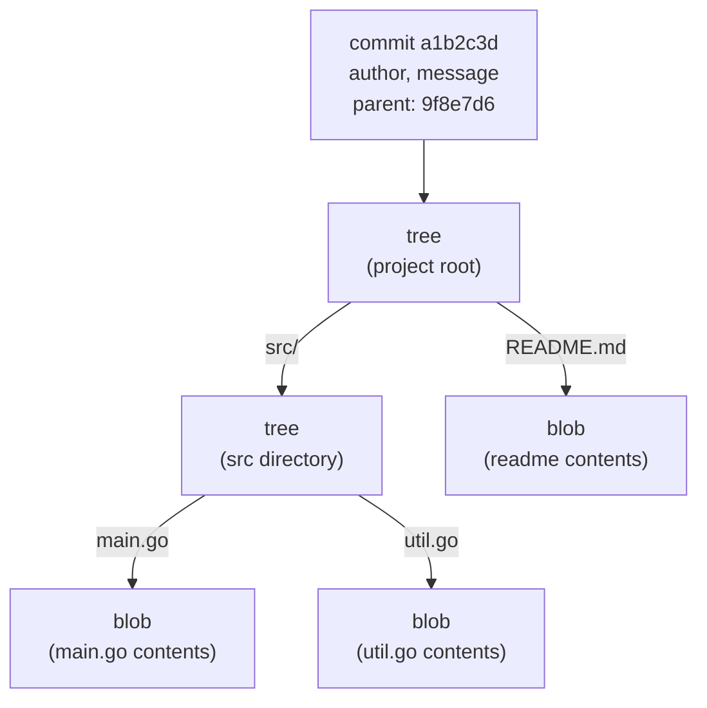

# Git for DevOps

Most git tutorials teach git as a tool for saving your work. This one treats it as what it becomes in DevOps: the reference point for your entire system. Here, a commit isn't just a record of what you wrote. It triggers pipelines, gates deployments, and records exactly what changed before it reached production. That shift changes what matters, from how you write commit messages to how carefully you rewrite history. So this guide starts with the theory, covering git's data model, its history graph, and its integrity guarantees, because you can't safely operate a pipeline until you understand what it's built on.

---

## Reading Order

- [Git's Data Model](#gits-data-model)
- [The Three Areas: Working Directory, Staging, Repository](#the-three-areas-working-directory-staging-repository)
- [History as a DAG](#history-as-a-dag)
- [Local vs Remote](#local-vs-remote)
- [History Integrity and Security](#history-integrity-and-security)
- [Branching Strategies](#branching-strategies)
- [Merge vs Rebase](#merge-vs-rebase)
- [Commits as a Machine-Readable Interface](#commits-as-a-machine-readable-interface)
- [Anatomy of the .git Directory](#anatomy-of-the-git-directory)

---

## Git's Data Model

The most common mental model of git is wrong. Most people picture it as a system that stores the *differences* between successive versions of their files: version 2 is version 1 plus these changes, version 3 is version 2 plus those changes, and so on. That is not how git works internally. Git stores **snapshots**. Every commit records the complete state of every tracked file at that moment. Diffs are not stored; they are computed on demand, by comparing two snapshots, whenever you ask to see one.

This distinction is not academic. Most of git's surprising behavior, including how it protects history from tampering, follows directly from the snapshot model. Get this right and the rest of git stops feeling arbitrary.

### Content addressing: the name is the content

Git stores everything as **objects** in a database (physically, under `.git/objects`). The defining property of this database is that every object is named by the cryptographic hash of its own contents. The address of an object is not assigned; it is derived from what the object holds.

Historically the hash function is SHA-1, producing a 40-character hexadecimal string like `d670460b4b4aece5915caf5c68d12f560a9fe3e4`. (Newer repositories can use SHA-256; the principle is identical.) The hash is computed not just from the file's bytes, but from a small header git prepends first: the object's type, a space, its size in bytes, and a null byte, followed by the content. So the stored object for a file containing the text `hello` is really the hash of `blob 5\0hello`.

The consequence is strict and useful: identical content always produces an identical hash, and any change to the content, however small, produces a completely different hash. There is no way to alter what an object contains while keeping its name. This single rule is the foundation everything else rests on.

### The four object types

Git's entire database is built from just four kinds of object.

A **blob** stores the raw contents of a file, and nothing else. It has no filename, no path, no timestamp, no permissions. Two files with byte-for-byte identical contents, anywhere in your project, under any names, are stored as a single blob, because they hash to the same value. This is git's built-in deduplication, and it is why the snapshot model is not as wasteful as it first sounds: a commit that changes one file in a thousand-file project does not copy the other 999 files. It reuses the existing blobs, because their content, and therefore their hash, has not changed.

A **tree** gives structure to blobs. It is essentially a directory listing: a set of entries, each pairing a name and a mode (file permissions) with the hash of what it points to. A tree entry points either to a blob (a file in that directory) or to another tree (a subdirectory). This recursive structure is how git represents your whole folder hierarchy. Filenames live in trees, not in blobs, which is the reason renaming a file with unchanged contents reuses the same blob and only writes a new tree.

A **commit** is a snapshot of the entire project at a point in time. It is a small object that points to exactly one tree, the root of your project as it looked at that moment, and to its parent commit or commits. It also carries metadata: the author and committer, their timestamps, and the commit message. Notice what this means: a commit does not contain your files. It points to a single root tree, which points to subtrees and blobs, and that graph of pointers reconstructs your project exactly.

A **tag** object is a named, usually annotated, pointer to another object, most often a commit. Tags are typically used to mark meaningful points such as releases, and annotated tags can themselves carry a message and be signed.

### How a snapshot fits together

Putting the pieces in order, a single commit expands into a tree of objects:

The commit names one root tree. That tree names a blob for `README.md` and a subtree for `src/`. The subtree names blobs for the files inside it. To check out this commit, git starts at the commit, walks to its tree, and rebuilds the working directory by following every pointer down to the blobs.

### The parent chain

The field that turns a pile of snapshots into a *history* is the commit's parent pointer. Every commit (except the very first) records the hash of the commit that came before it. A normal commit has one parent. A merge commit has two or more, which is how two lines of development are joined. A tree of commits linked by these parent pointers is the commit history, and following the pointers backward walks you through time.

Because a commit's hash is computed over its content, and its content *includes the hash of its parent*, the history forms a chain in which each link seals the one before it. If you were to change a commit deep in the past, its hash would change; the child that recorded the old parent hash would now be pointing at something that no longer exists, so the child's content is effectively different, so the child's hash changes too, and this cascade continues all the way to the tip. You cannot alter one commit in the middle of history and leave the rest intact. The structure makes tampering evident.

### What follows from all this

Three practical facts, each of which we return to later, are direct consequences of the model rather than separate rules to memorize.

Commits are immutable. Since the hash is derived from the content, "editing" a commit is impossible; operations like amend, rebase, and squash create new commits and move a branch pointer to them, leaving the originals behind. 

History is verifiable. The parent-hash chain means a commit hash certifies not just one snapshot but the entire history leading to it. When a pipeline builds or deploys commit `a1b2c3d`, that hash is an exact, tamper-evident name for a precise state of the codebase, which is what makes hash-pinned deploys and rollbacks trustworthy.

Secrets are permanent. Committing a credential writes it into a blob, sealed under a commit hash. Deleting the file in a later commit adds a new snapshot where the file is absent, but the earlier commit, its hash, and the blob it points to all still exist and remain reachable. Removing a leaked secret from history means rewriting every commit from the leak onward (producing new hashes for all of them), and the only safe assumption in the meantime is that the credential is compromised and must be rotated.
